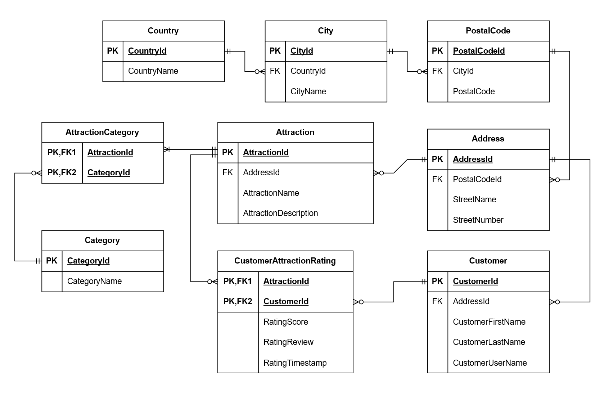

# Attraction Rating App

Det här projektet fokuserar på Microsoft SQL Server. Det bygger i och för sig för SQL Server, MySQL/MariaDb och Postgres 
utan att krascha, men Check Constraints i Fluent API är i en syntax som är anpassad för Microsoft SQL Server.

### Modellering i C# för Entity Framework Core (DbModels)

 
<i>Klicka på diagrammet för att öppna och zooma i full upplösning.</i>

Jag har utgått från samma SQL-databas som jag skapade i SQL-kursen. När ER-diagrammet gjordes om till C#-klasser i `2c_DbModels` 
och konfigurerades i `MainDbContext` så strukturerades koden enligt följande principer:

1. **Entitetsklasser (`DbM`) och gränssnitt (`Interfaces`):**
   Varje tabell i ER-diagrammet representeras av en C#-klass med suffixet `DbM` (t.ex. `AttractionDbM`, `CustomerDbM`). Jag började
   nerifrån och gick uppåt genom lagren/abstraktionsnivån när jag modellerade. Först gjorde jag de vanliga modellerna (utifrån 
   Interface) i 3_Models, som sedan kopplades ihop med databasmodellerna i 2c_DbModels genom arv. Detta gör att applikationslagret och 
   controllern kan arbeta mot rena abstraktioner.

2. **Nycklar och relationer i C#:**
   - **Primärnycklar:** Samtliga klasser använder `Guid` som primärnyckel dekorerad med `[Key]`.
   - **Navigeringsegenskaper:** För att tydliggöra för EF Core hur relationerna implementerades från ER-diagrammet så har klasserna 
   försetts med både främmande nycklar och navigeringsegenskaper:
     - I *en-till-många-relationer* har "många"-sidan en explicit foreign key-egenskap (`public Guid AddressId { get; set; }`) samt 
     navigationsobjektet (`public AddressDbM AddressDbM { get; set; }`).
     - "En"-sidan har motsvarande samling (`public List<AttractionDbM> AttractionsDbM { get; set; }`).
   - **Sammansatta nycklar:** I kopplingstabellerna `AttractionCategoryDbM` och `CustomerAttractionRatingDbM` definieras 
     de sammansatta primärnycklarna (Composite Keys) direkt på klassen:
     - `[PrimaryKey(nameof(AttractionId), nameof(CategoryId))]`
     - `[PrimaryKey(nameof(CustomerId), nameof(AttractionId))]`
   - **Sammansatta och omvända index:** För att optimera sökprestandan deklareras indexen direkt på AttractionCategoryDbM:
     - `[Index(nameof(AttractionId), nameof(CategoryId))]`
     - `[Index(nameof(CategoryId), nameof(AttractionId))]`

3. **Data Annotations & Dataintegritet:**
   För att tvinga fram databasens `NOT NULL` och kolumntyper direkt från C#-koden har Data Annotations använts:
   - `[Required]` används på alla obligatoriska strängar och främmande nycklar.
   - `[MaxLength(200)]` styr att strängar inte blir godtyckliga `nvarchar(max)`, vilket optimerar lagring och prestanda.
   - Valfria fält (som `StreetNumber` och `RatingReview`) definieras som nullable (`string?`) för att matcha databasens `NULL`-tillåtelse.

4. **Seeding och hantering av testdata:**
   Varje entitetsklass i C# har försetts med egenskapen `public bool Seeded { get; set; }`. Detta gör det möjligt för seedgeneratorn
   att markera genererad testdata, vilket underlättar både filtrering och automatiserad upprensning via API:et.

5. **SQL Server Check Constraints via EF Core:**
   Villkor som inte kan uttryckas med vanliga C#-attribut (exempelvis att `RatingScore` måste ligga mellan 1 och 5, samt att e-postformat 
   valideras) lades till via `ToTable(t => t.HasCheckConstraint(...))` i `SqlServerDbContext.OnModelCreating`.